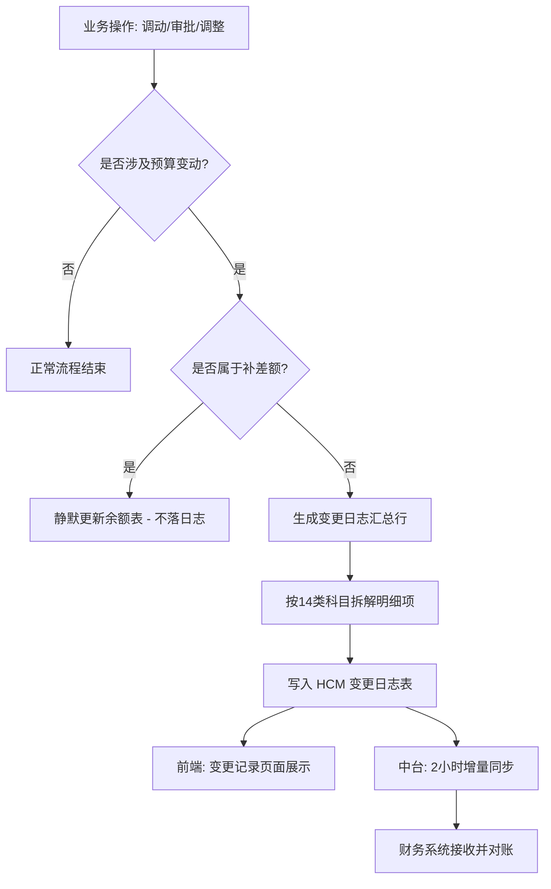

# HCM 系统：预算变更记录功能全量详细设计方案 (v4.0)

## 1. 功能定位与核心价值

### 1.1 功能定位
本功能作为 HCM 系统与财务系统之间的“数据枢纽”，旨在通过结构化的日志记录，追踪所有涉及编制（HC）与人力成本预算的业务变动（如审批、调动、组织调整等）。它是实现企业“人财对账”自动化、精细化的核心组件。

### 1.2 核心价值
- **对财务（Finance）**：提供“科目级+项目级”的准实时变动明细，确保财务预算系统（EPM/ERP）与人力成本发生的完全一致，消除手工对账误差。
- **对 HR/编制专员**：提供透明的预算变动流水线，可回溯每一笔金额变动的来源单据及分摊逻辑，解决“预算去哪了”的合规性查询痛点。
- **对管理层**：通过 HC 变动与成本变动的联动展示，直观呈现人才投入与财务支出的动态关联，辅助经营决策。

---

## 2. 用户旅程与关键场景

### 2.1 典型用户旅程
1. **触发变更**：HR 在“人员调动”模块发起一个带 HC 的跨部门调动流程。
2. **流程审批**：相关领导审批通过，业务生效。
3. **日志落地**：系统后台自动拆解该笔业务涉及的 14 类科目明细，生成 `LOG-2026xxxx` 编号。
4. **查询回溯**：财务专员在“预算变更记录”页面，通过搜索“调动”或“部门名称”，查看到该笔变动，并展开明细确认科目分摊（如工资、公积金等）是否正确。
5. **中台同步**：数据中台每 2 小时自动抓取该记录，同步至财务系统。

### 2.2 关键业务场景
| 场景名称 | 业务逻辑 | 关键挑战 |
| :--- | :--- | :--- |
| **带 HC 调动** | 涉及调出部门的预算调减与调入部门的预算调增。 | 需确保调出与调入的两条对冲日志逻辑严密。 |
| **预算审批生效** | 针对特定部门的增量预算申请通过。 | 需将总额精确拆分至 14 个标准财务科目。 |
| **补差额静默处理** | 因入职时间差异或调薪导致的系统自动重算补差额。 | **不生成日志**，避免对外部财务系统造成噪声干扰。 |
| **部门撤销/剪切** | 组织架构调整导致的大规模预算平移。 | 涉及多条日志的批量生成与关联关系。 |

---

## 3. 信息架构与交互流程图

### 3.1 信息架构 (IA)
- **汇总层 (Master)**：全局唯一 ID、时间戳、业务类型、责任部门、HC 增量、总金额增量。
- **明细层 (Detail)**：科目 ID、科目名称、项目标签、明细金额（科目级分摊）。
- **关联层 (Link)**：原始审批单据 URL（支持穿透回溯）、操作人。

### 3.2 交互流程图

---

## 4. 数据模型与字段定义

### 4.1 核心日志表 (budget_change_log)
| 字段名 | 类型 | 说明 | 约束 |
| :--- | :--- | :--- | :--- |
| log_id | String | 日志编号，例：LOG-20260413-001 | 主键 |
| biz_type | Enum | 变更类型：TRANSFER_IN/OUT, APPROVAL, DEPT_MOVE... | 非空 |
| dept_id | String | 涉及部门代码 | 关联部门表 |
| person_category | String | 类别：正编/实习生/外包 | 非空 |
| hc_delta | Integer | HC 变动数（纯费用为 0） | - |
| amount_total | Decimal | 总额变动（元），保留两位小数 | - |
| is_supplement_diff | Boolean | 是否补差额标识（前端过滤用） | 默认 false |
| effective_time | Datetime | 发生时间（秒级） | 默认系统时间 |

### 4.2 明细表 (budget_change_detail)
| 字段名 | 类型 | 说明 | 约束 |
| :--- | :--- | :--- | :--- |
| detail_id | String | 明细唯一标识 | 主键 |
| log_id | String | 关联主日志 ID | 外键 |
| account_id | String | 财务科目 ID (ACC-001 ~ ACC-014) | 非空 |
| project_tag | String | 项目标签（如：完美世界项目 A） | 可为空 |
| amount_delta | Decimal | 该明细项变动金额 | 所有明细之和 = 主表 amount_total |

---

## 5. 验收标准与埋点需求

### 5.1 验收标准 (AC)
- **AC1-列表展示**：数值增加显示为红色 `+`，减少显示为绿色 `-`。变更类型 Tag 颜色符合 UI 规范。
- **AC2-展开逻辑**：点击行首 `+` 展开的明细子表金额总和，必须严格等于汇总行的总额。
- **AC3-同步逻辑**：数据中台在 T+2 小时内应能查询到新生成的非补差额日志。
- **AC4-过滤规则**：标记为 `is_supplement_diff = true` 的记录严禁在前端显示，且严禁传输至中台。

### 5.2 埋点需求
| 事件 ID | 事件名称 | 触发条件 | 携带参数 |
| :--- | :--- | :--- | :--- |
| log_view | 记录查看 | 进入变更记录页面 | 部门过滤范围 |
| log_expand | 明细下钻 | 点击表格行展开图标 | 日志编号、变更类型 |
| log_export | 数据导出 | 点击导出按钮 | 导出的时间区间、部门 |

---

## 6. 版本兼容及迁移计划

### 6.1 兼容性策略
- **前端组件**：采用 Ant Design Vue 4.x，确保与 HCM0107 主工程风格一致。
- **API 接口**：新增 `/api/v1/budget/logs` 接口，采用 V1 版本号，不影响现有审批流接口。

### 6.2 数据迁移
- **存量数据**：由于 v3.0 之前未记录明细，历史数据在列表页显示“无明细”，或通过脚本按默认比例进行模拟拆分（需业务部门确认）。
- **迁移窗口**：预计在凌晨 02:00 - 04:00 进行 DDL 变更，同步开启中台增量抽取任务。

---

## 7. 风险评估与应对预案

| 风险点 | 风险等级 | 应对预案 |
| :--- | :--- | :--- |
| **数据不一致** | 高 | 增加“日终对账脚本”，自动比对 HCM 余额表与日志表总和，若不一致则向运维发送 Alert。 |
| **性能瓶颈** | 中 | 随着日志积累，单表可能突破百万级。计划按年度进行分区存储，并对 `dept_id` 和 `effective_time` 建立复合索引。 |
| **中台同步失败** | 低 | 在日志表增加 `sync_status` 字段，若中台反馈接收失败，HCM 侧支持手动触发重发流程。 |

---
**文档信息**
- **状态**：待评审 (Draft)
- **版本**：v4.0
- **编写人**：AI 产品助理
- **日期**：2026-04-14