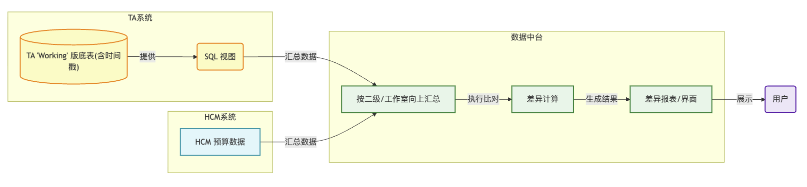

[会议纪要]HCM&TA工薪预算双向校验技术方案讨论

一、 会议基本信息

会议主题： HCM&TA工薪预算双向校验技术方案讨论

会议时间： 2025年11月18日 10:30~12:00

参会人员： @Michael（赵辉） @丁国亮 @洪河（马亚广） @轩辕（袁敬强） @冯源 @Tad（董科） @王乃乾 @Chord（孙弦） 

会议目的： 针对HCM人事系统与TA财务系统间预算及组织数据存在不一致的问题，讨论并明确数据双向校验方案

二、 讨论内容总结

1. 数据不一致原因

处理机制差异： HCM人事系统的组织架构调整或预算变动以天为单位，而TA财务系统的数据处理是“后置”的，且依赖财务人员手动、分批次确认。

时间滞后与版本错位： TA的手动确认机制导致其数据版本必然滞后于HCM。例如，HCM在17号更新了数据，TA可能要几天后才处理，导致校验时永远存在时间差。

映射与颗粒度问题： TA系统内的组织架构（如二级部门）与HCM或PS的组织架构存在映射差异，甚至有自定义节点。

2. 长短期方案

长期方案： 明年Q1推动建立统一的“主数据”系统。由主数据承载全局组织树，分发给各应用系统消费，从根本上解决架构不一致的问题。

短期方案： TA及HCM数据统一传输至数据中台，在“中台”进行比对，目的在于暴露差异，而不是强行拉平数据。

3. 短期方案技术实现

校验颗粒度： 因在四级部门层级不存在组织多对一、一对多等情况，明细数据的颗粒度定为“四级部门”层级，三级及以上部门的校验由中台进行汇总后再进行比对。

数据比对内容：比对工薪预算层级数据（包含五险一金等数据）

数据责任方： HCM、TA侧分别提供数据和查询逻辑，“中台”负责在中台层面进行数据汇总、比对和差异展示。

TA的数据版本问题： TA内部有数据落地、拷贝前的“Working”版和财务确认、拷贝后的“IPO”版。暂定使用“Working”版，因为它保留了原始数据的时间戳，有助于在中台界面暴露因时间差导致的差异。

差异呈现： 中台的比对界面需要清晰展示差异，并附带TA侧数据的“最后更新时间”，帮助用户判断差异是源于TA未更新，还是系统逻辑问题。

三、 待办事项

提供TA数据视图： TA侧整理并提供TA底表数据的SQL查询视图给中台。

负责人： 冯源

截止时间： 预计下周（11月底之前）

开发比对功能： 中台基于TA提供的视图及HCM数据，开发数据汇总、比对逻辑及差异展示界面。

负责人： 马亚广、丁国亮

截止时间： 12月底

启动主数据项目调研： 在年底前启动主数据项目的调研工作，为明年Q1的正式落地做准备。

负责人： 冯源、马亚广

截止时间： 今年年底启动

四、 风险与关注点

重复工作风险： 当前投入资源开发的短期方案，在明年Q1主数据系统上线后尽量不被颠覆，避免造成资源浪费。

“合理差异”的干扰： 由于TA侧业务特性导致的手动处理和数据滞后，校验界面会暴露大量因时间差导致的“合理”差异，即噪声太多，需确保用户正确理解这些差异。

潜在的映射复杂度： 特殊组织架构（如HRIS案例）等问题，目前映射关系仍依赖人工处理。即使建立主数据管理系统仍是数据治理的难点，应提前考虑自动映射方案。

五、数据传输及处理逻辑

