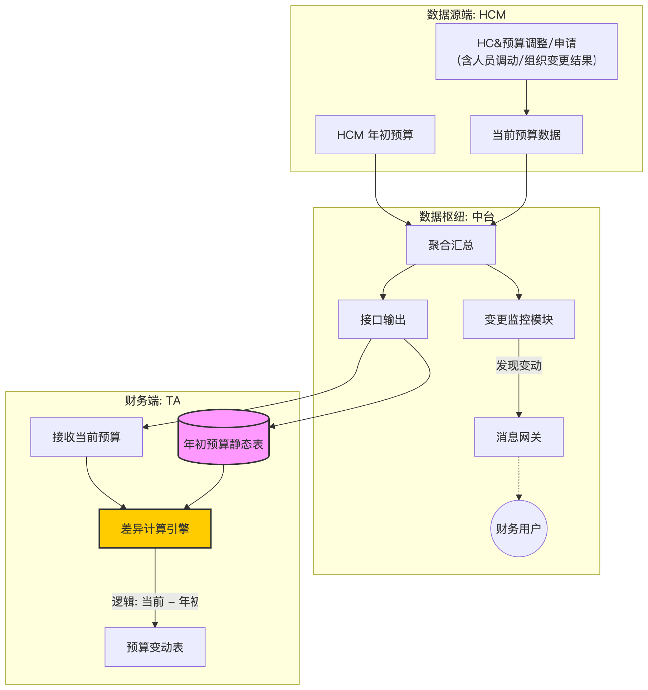
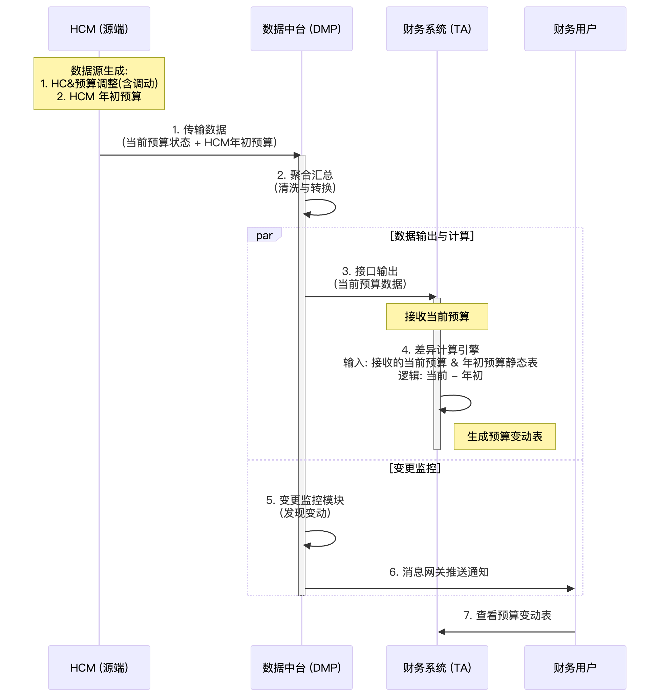

HCM-TA 工薪预算数据交互

一、 背景与现状

1.1 业务背景

业务目标：财务系统 (TA) 需要及时掌握人力预算的编制及调整情况，特别是各部门的“当前预算”与“年初预算”之间的差异。

“差异”财务视角定义：无论因何种原因（包括内部人员流动、组织调整或主动增补）导致部门当前预算总额与年初定案不同，均视为“预算变动”，需在TA系统中体现差异。

1.2 数据资产分布现状

HCM 系统 (源端)：

负责维护HC和预算的当前最新状态。

当发生人员调动（带预算）或组织剪切调整时，HCM 会自动更新相关部门的当前预算总额。

核心资产：① 年初预算；② “当前最新预算”。

TA系统 (消费端)：

需要存储“年初预算”。该数据在预算年度审批后锁定，不随人员流动或组织变更而自动调整。

核心资产：① “年初预算”；② 当前预算与年初预算的“差异”。

数据中台 (传输端)：

作为数据枢纽，存储了HC与人力预算数据（包含年初预算的副本）。

负责数据的清洗、转换与监控。

二、 系统交互示意

以TA系统计算“差异”为例

数据流转图

数据处理时序图

三、 差异发现与通知机制

3.1 监控对象

数据中台在每 3 小时的数据同步任务中，对比 本次传输数据 与 上一次传输数据。

3.2 触发条件

预算变更：该部门的 当前预算 发生变动（意味着发生了新的HC申请（或减员），或是人员调动，组织变动等情况）

3.3 通知执行

执行方：数据中台

接收方：对应核算单元的财务 BP 或预算管理员

需要TA提供通知规则

通知内容：待定

四、 预算差异计算

4.1 方案对比

维度

方案一：TA 系统计算

方案二：中台计算差异

五、 结论

数据流向：HCM 传输“当前最新预算”和“年初预算”；TA和中台间待讨论

计算策略：数据中台 or TA处理

